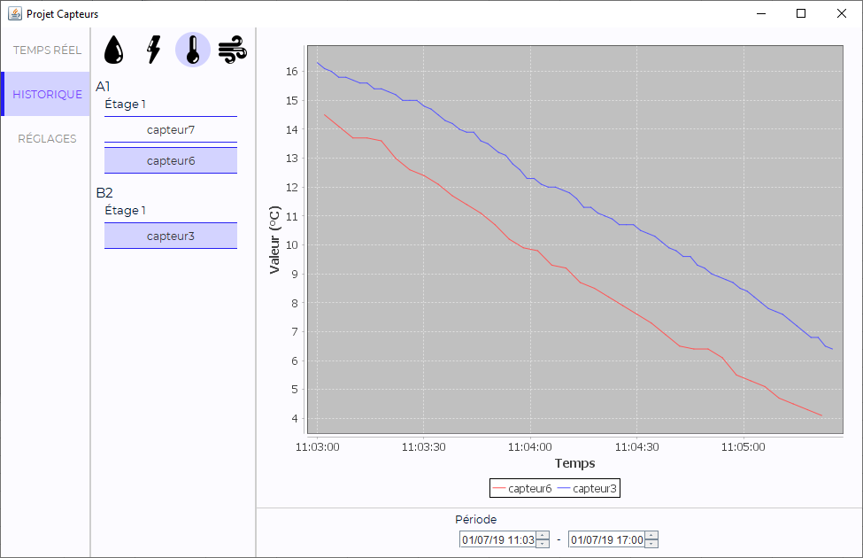

# Projet Capteurs
Projet scolaire de 2018 permettant de visualiser et d'analyser les
données de consommation provenant de capteurs connectés. Développé avec
Swing :unamused:.

## Fonctionnalités
### Affichage des capteurs en temps réel
Ce panneau permet de visualiser les données en provenance des capteurs en temps
réel. Les capteurs dont la valeur courante est hors des seuils définis sont mis
en évidence.

Il est possible de limiter l'affichage à certains types de capteurs et/ou
bâtiments.

### Historique des données
L'application stocke les données reçues pour permettre leur visualisation
*a posteriori*.

### Configuration des capteurs

## Installation
### Prérequis
L'application nécessite les outils suivants (non fournis) :
- [JFreeChart](http://www.jfree.org/jfreechart/)
- [MySQL Connector/J](https://dev.mysql.com/downloads/connector/j/)
- [MySQL](https://dev.mysql.com/downloads/mysql/)
- Serveur pour l'envoi des données

### Communication avec le serveur
Un serveur est nécessaire pour envoyer les données des capteurs à l'application.
Il doit respecter le protocole de communication suivant.

#### Connexion d'un capteur
Message au format suivant : **connexion** *nom_capteur* *description*.

Avec *description* au format `type:bâtiment:étage:lieu` et
- `type` : le type de fluide géré par le capteur (EAU, ELECTRICITE, AIRCOMPRIME
ou TEMPERATURE) ;
- `bâtiment` : le bâtiment dans lequel se trouve le capteur (chaîne de caractères) ;
- `étage` : l'étage auquel se situe le capteur (nombre entier) ;
- `lieu` : description plus précise de la localisation (chaîne de caractères).

#### Envoi de la valeur d'un capteur
Message au format suivant : **donnee** *nom_capteur* *valeur*, avec *valeur* un
réel représentant la valeur courante du capteur.

#### Déconnexion d'un capteur
Message au format suivant : **deconnexion** *nom_capteur*.

### Création de la base de données
Le fichier `db.sql` permet de créer les tables de la base de données, il suffit
de l'importer dans une base MySQL. Les informations de connexion à la base
doivent être renseignés dans le fichier `src/database/MySQLConnection.java`.

## Utilisation
Il suffit de lancer l'application puis de démarrer le serveur pour commencer à
collecter les données.
